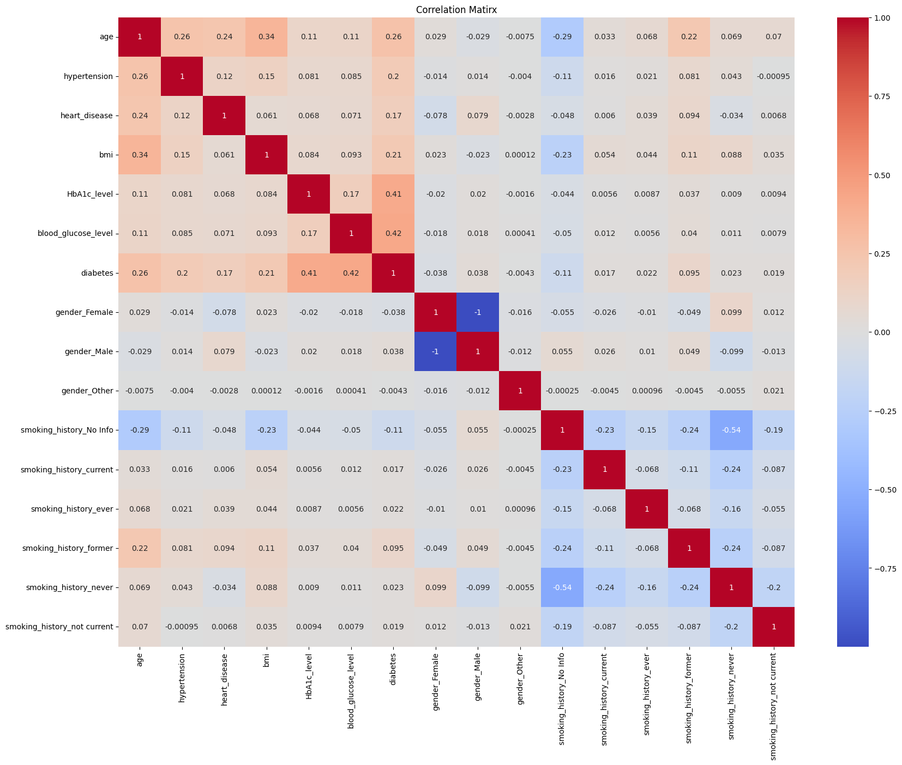
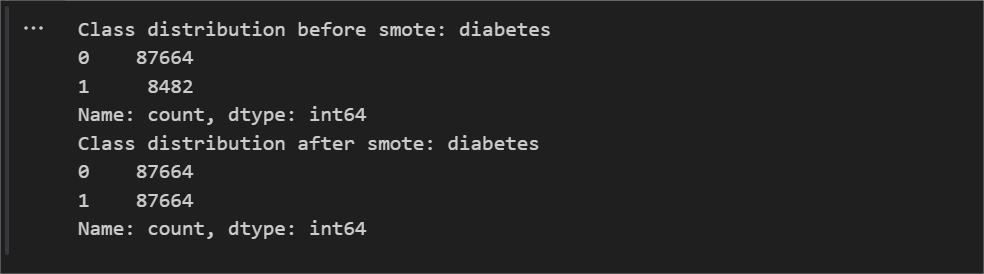
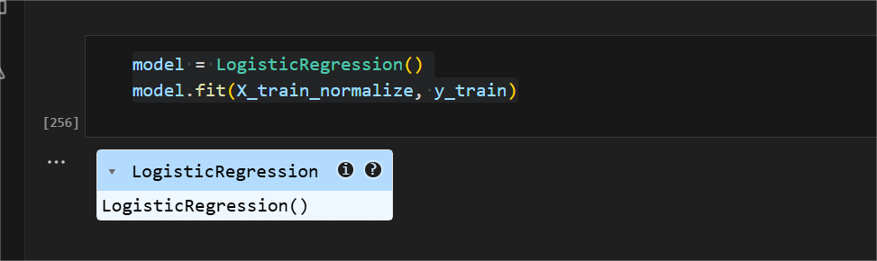
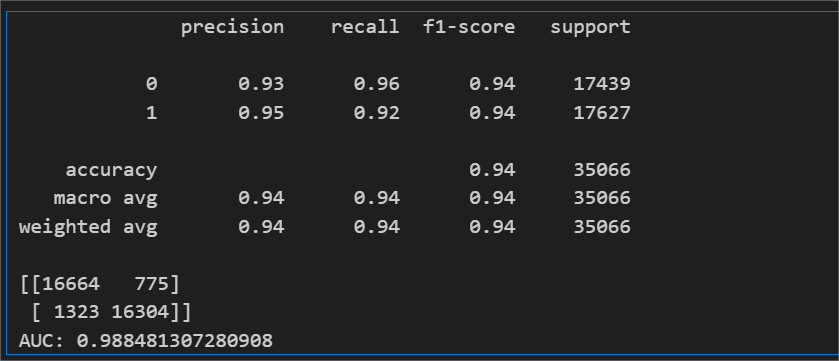
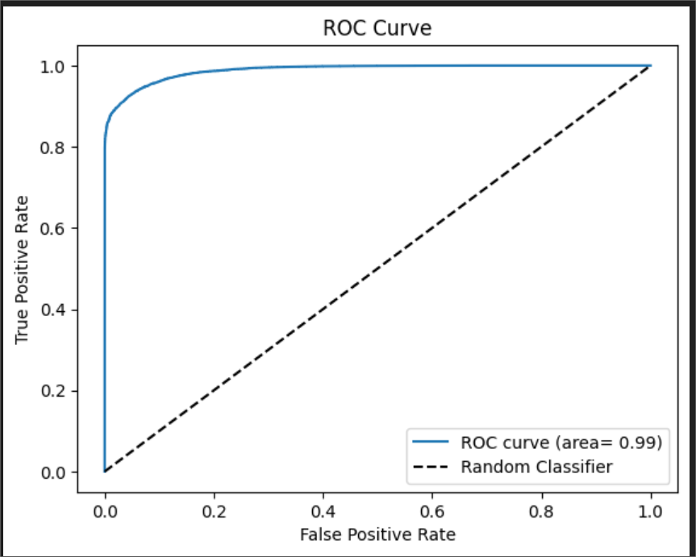

## 🩺 Diabetes Prediction using Logistic Regression
This project builds a machine learning model to predict whether a patient has diabetes based on medical diagnostic data.
The workflow includes data preprocessing, exploratory data analysis (EDA), handling imbalance using SMOTE, training Logistic Regression, and evaluating the model.

## 📂 Project Structure
```bash
Diabetes_Prediction_Machine_Learning/
│── assets/
│ └── screenshots/ # All analysis & results screenshots
│
│── data/ # Dataset
│ └── diabetes_prediction_dataset.csv
│
│── src/ # Source code (Jupyter Notebook)
│ └── Diabetes_Logistic2.ipynb
│
└── README.md # Project documentation
```

## 📊 Dataset
- Source: Kaggle – Diabetes Dataset
- Features include:
  - Age
  - BMI
  - Blood Glucose Level
  - HbA1c Level
  -  Gender, Smoking history, etc.
- Target: Diabetes diagnosis (0 = No Diabetes, 1 = Diabetes)

## ✨ Features
- Data preprocessing (handling missing values, duplicates, encoding categorical data).
- Exploratory Data Analysis (distribution, correlation, outliers).
- Outlier detection and clipping.
- Class balancing with **SMOTE**.
- Model training using **Logistic Regression**.
- Evaluation with **Accuracy, Precision, Recall, F1-score, ROC Curve**.

## 📊 Dataset Overview

**Head of Dataset**
[Head](assets/screenshots/01_df_head.png)

**Info**
[Info](assets/screenshots/02_df_info.png)

**Data Types**
[Dtypes](assets/screenshots/04_df_dtypes.png)

**Describe**
[Describe](assets/screenshots/03_df_describe.png)

**Missing Values**
[Missing Values](assets/screenshots/05_missing_values.png)

---

## 🔎 Exploratory Data Analysis

**Histogram Distribution**
- Age  
  [Histogram Age](assets/screenshots/06_histogram_age.png)  
- Blood Glucose Level  
  [Histogram Glucose](assets/screenshots/07_histogram_blood_glucose.png)  

**Boxplot Outliers**
- BMI  
  [Boxplot BMI](assets/screenshots/08_boxplot_bmi.png)  
- HbA1c Level  
  [Boxplot HbA1c](assets/screenshots/09_boxplot_hba1c.png)  

**Detected Outliers**
[Outliers Data](assets/screenshots/10_outliers_detected.png)

**After Deleting Outliers**
[After Delete Outliers](assets/screenshots/11_after_outlier_removal.png)

---

## 📈 Correlation Analysis

**Correlation with Target (Diabetes)**
[Correlation With Target](assets/screenshots/12_correlation_with_target.png)

**Correlation Matrix**
[Correlation Matrix](assets/screenshots/13_correlation_matrix.png)

**Heatmap**


---

## ⚡ Data Resampling (SMOTE)


---

## 🤖 Model Training & Evaluation

**Logistic Regression Model**


**Classification Report**


**ROC Curve**


---

## 📊 Results

- **Accuracy**: 94%
  
- **Precision**:
  - Class 0 (No Diabetes): 93%
  - Class 1 (Diabetes): 95%
    
- **Recall**:
  - Class 0 (No Diabetes): 96%
  - Class 1 (Diabetes): 92%
    
- **F1-score**: 94% (both classes balanced)

- **AUC (Area Under Curve)**: 0.988

- **Confusion Matrix**:
 ```bash
 [[16664   775]   → True Negatives / False Positives
 [ 1323 16304]]   → False Negatives / True Positives
 ```

- **Interpretation**:
  - The model achieved high accuracy (94%) with a balanced performance across both classes.
  - Recall for diabetes (92%) indicates the model is good at detecting actual diabetic patients.
  - Precision for diabetes (95%) shows the model rarely predicts diabetes incorrectly.
  - The AUC of 0.988 suggests excellent discriminative ability between diabetic and non-diabetic patients.


## 🚀 How to Run

1. Clone this repository:
   ```bash
   git clone https://github.com/colinwilson06/diabetes-prediction-ml.git
   cd diabetes-prediction-ml
   ```
   
2. Install dependencies:
   ```bash
   pip install -r requirements.txt
   ```
   
3. Run the notebook:
   ```bash
   jupyter notebook src/Diabetes_Logistic2.ipynb
   ```

## 📦 Requirements
- Python 3.8+
- pandas
- numpy
- matplotlib
- seaborn
- scikit-learn
- imbalanced-learn (for SMOTE)
Install all with:
```bash
pip install -r requirements.txt
```


## 📌 Notes
- Dataset: data/diabetes_prediction_dataset.csv
- Folder assets/screenshots/ contains all analysis and model evaluation images.
- This project focuses on EDA and Logistic Regression (not deployment).

